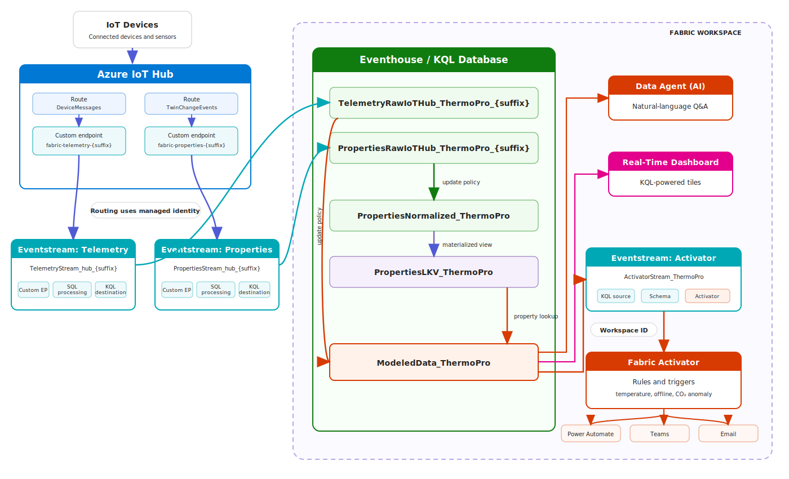
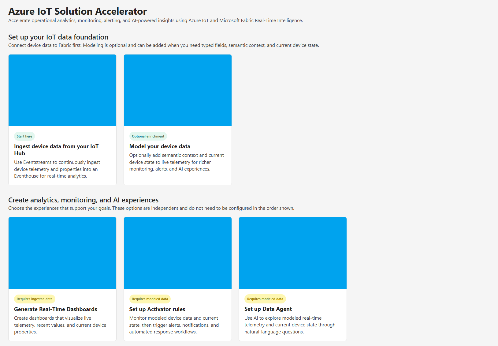
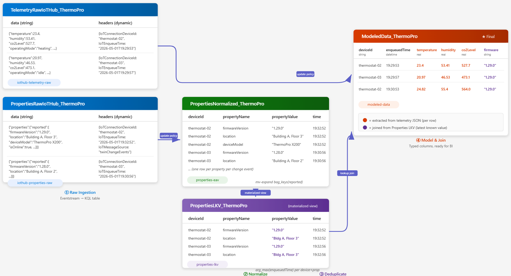

# Azure IoT Solution Accelerator Workload for Microsoft Fabric Real-Time Intelligence

The Azure IoT Solution Accelerator Workload for Microsoft Fabric is a sample that
demonstrates how Azure IoT device data can be turned into real-time analytics, operational
monitoring, automated actions, and AI-powered insights using Fabric Real-Time Intelligence.

Once deployed to your tenant, the workload provides guided experiences that automate the setup of
common IoT data and analytics patterns. It connects telemetry and device twin changes from an
existing Azure IoT Hub to Fabric, ingests query-ready data into an Eventhouse, and helps users
generate dashboards, modeled datasets, Activator monitoring, and a Fabric Data Agent.

> [!IMPORTANT]
> This project is a sample solution accelerator and reference implementation, not a managed
> Microsoft product. It is intended to help customers, partners, architects, and developers
> evaluate and accelerate IoT solutions built with Azure IoT and Microsoft Fabric. Review and
> adapt the implementation for your production, security, governance, scale, and support
> requirements.

## What this workload enables

This accelerator helps organizations:

- Reduce the time and expertise required to connect Azure IoT data to Fabric Real-Time
  Intelligence.
- Retain raw telemetry and property updates for real-time and historical analysis.
- Turn live device signals into operational dashboards, alerts, notifications, and automated
  response workflows.
- Add semantic context from DTDL device models, making device data easier to query and understand.
- Explore device operations through natural-language questions grounded in real Fabric data.
- Use the generated solution as a starting point for industry-specific or organization-specific
  IoT experiences.

Azure IoT Hub remains responsible for device connectivity, communication, and message routing.
Microsoft Fabric provides the analytics, monitoring, automation, and AI experiences built on the
device data.

## Who can benefit from this solution

This project is designed for:

- Azure IoT Hub customers who want to analyze device data using Microsoft Fabric.
- Teams evaluating Fabric Real-Time Intelligence for new IoT solutions or as an analytics
  alternative for existing solutions.
- Solution architects and developers building organization-specific IoT analytics and operational
  intelligence experiences.
- Partners creating reusable, industry-focused solutions with Azure IoT and Microsoft Fabric.

The workload can be built and run locally or hosted by the user and uploaded to their own Fabric
tenant. The source code is included so organizations can own the deployment, customize the
experience, and extend it for their requirements.

## Setup and deployment

Follow the steps below to set up and deploy the workload:

> Prerequisites: the setup commands below require PowerShell 7+, Node.js, and npm.

1. Clone this repository.
2. [Create the Microsoft Entra application for the workload](docs/create-entra-app.md).
3. Run the workload setup script:

   ```powershell
   # $appId is the application ID (FrontendAppId) obtained from the Entra application creation step.
   pwsh ./scripts/Setup/Setup.ps1 `
       -FrontendAppId $appId `
       -WorkloadName "Org.IoTSolutionAccelerator"
   ```

4. Choose the deployment option:

   - [Run the workload in local mode](docs/local-mode.md).
   - [Host the workload in Azure and make it available across your tenant](docs/publish-to-azure-and-tenant.md).

Once setup and deployment are complete, the **Azure IoT Solution Accelerator** workload will be
available in your Fabric [Workload
Hub](https://learn.microsoft.com/en-us/fabric/workload-development-kit/more-workloads-add) and the
corresponding item type will be available for creation in your Fabric workspace.

## Extend and customize the workload

This project is based on the
[Microsoft Fabric Extensibility Toolkit](https://learn.microsoft.com/en-us/fabric/extensibility-toolkit/extensibility-toolkit-overview),
which provides the SDK, application structure, manifests, development gateway, build scripts, and
Fabric integration used by the workload.

The repository contains the complete workload source and is intended to be customized. For
example, you can:

- Change the workload and item names, descriptions, help text, links, publisher information, and
  branding.
- Replace the workload, item, and Workload Hub icons and images.
- Add, remove, or reorganize wizard steps and accelerator experiences.
- Change generated resource names, defaults, queries, schemas, validation, and provisioning
  behavior.
- Add new Fabric item types or integrate additional Fabric and Azure services.
- Extend dashboards, modeling logic, Activator setup, and Data Agent instructions for specific
  devices, industries, or business processes.
- Introduce your own deployment, authentication, governance, telemetry, and support model.

Use the Fabric Extensibility Toolkit documentation and samples when changing the workload
manifest, adding item types, or integrating additional Fabric platform capabilities.

## What the workload offers and how to use it

The workload provides a guided path from raw Azure IoT Hub messages to analytics, monitoring,
automation, and AI experiences in Fabric. The following reference architecture shows the resources
and data flows that the different workload options can generate. Refer back to it as you work
through the experiences below.



After setup and deployment:

1. Open the configured Fabric workspace.
2. Create a new **Azure IoT Solution Accelerator** item.
3. Open the item to access the accelerator experiences.



The home page is organized into two sections:

- **Set up your IoT data foundation** establishes the reusable data layer. Start by ingesting raw
  telemetry and property updates. Modeling is optional and adds typed fields, semantic meaning,
  and current device state when richer context is needed.
- **Create analytics, monitoring, and AI experiences** uses that foundation to produce business
  outcomes. Dashboards operate directly on ingested raw data, while Activator and Data Agent use
  modeled data for context-aware monitoring and reasoning.

The experiences do not all need to be configured. Choose the ones that support your use case,
subject to the prerequisites shown on each card.

### Ingest device data from your IoT Hub

This is the starting point for the accelerator. The ingestion experience creates a continuous,
managed-identity-secured data path from an existing Azure IoT Hub to an existing Eventhouse and KQL
database in the current Fabric workspace.

It separates device telemetry and twin property updates into independent streams and retains both
in raw, query-ready tables. This gives teams a reusable source for real-time monitoring, historical
analysis, troubleshooting, dashboards, and future data products without changing the device
connectivity layer.

**What the experience configures:**

- Two IoT Hub routes and custom endpoints: one for device telemetry and one for twin property
  changes.
- Workspace access for the IoT Hub managed identity.
- Two Eventstreams with custom endpoints, SQL processing, and KQL destinations.
- Raw telemetry and property tables in the selected KQL database.

**Generated flow:**

`Devices → Azure IoT Hub routes → custom endpoints using managed identity → Eventstreams → SQL processing → raw Eventhouse tables`

When complete, new telemetry and property updates flow continuously into Fabric. You can query the
raw tables directly, generate a Real-Time Dashboard, or optionally create a modeled dataset.

### Model your device data

Raw IoT messages are flexible, but repeatedly parsing JSON and interpreting field names makes
analytics, monitoring, and AI experiences harder to build and maintain. The optional modeling
experience uses a DTDL device model or an IoT Central device template export to turn selected
telemetry and reported properties into typed, business-friendly fields.

It also combines telemetry events with the latest reported device state. This enables scenarios
such as evaluating temperature by operating mode, vibration by firmware version, or energy
consumption by configured setpoint. The original raw tables remain available for fields and use
cases that are not included in the model.

**What the experience configures:**

- A normalized properties table containing property name, value, device, and timestamp history.
- A materialized last-known-value view containing the latest property state reported by each
  device within the previous 30 days.
- A modeled data table containing typed telemetry fields enriched with current modeled property
  values.
- KQL update policies that continuously maintain the generated entities as new data arrives.

**Generated flow:**

`Raw property updates → normalized property history → latest property state`

`Raw telemetry + device model + latest property state → typed, enriched modeled data`

The following example illustrates how real telemetry and property values move through the
generated entities and become a modeled row:



The modeled table becomes the semantic foundation for context-aware Activator rules and the Fabric
Data Agent. It can also be queried directly or used by other Fabric experiences.

### Generate Real-Time Dashboards

The dashboard experience creates an editable Fabric Real-Time Dashboard directly from the raw
telemetry and property tables. It provides an immediate operational view without requiring a
device model.

The wizard inspects recent data, lets you choose the fields that matter, and generates:

- Time-series charts for numeric telemetry.
- Recent-value tables for non-numeric telemetry.
- Last-known-value cards for device properties.
- A Device ID parameter and time-range filtering for device-level investigation.
- Editable KQL queries and a dashboard layout that can be extended with calculations, thresholds,
  comparisons, and business-specific visuals.

**Generated flow:**

`Raw telemetry and properties → field discovery → generated KQL queries → Real-Time Dashboard → operational insight`

Use the generated dashboard to monitor current behavior, investigate historical trends, and
identify changes in device state. If the raw field names or schemas are not sufficient, create a
modeled dataset for stronger semantic context.

### Set up Activator rules

The Activator experience connects live modeled device events to Fabric Activator so operational
conditions can trigger alerts and automated responses. Modeled fields make rules easier to
understand and maintain because measurements and current device state are available as typed,
business-friendly values.

**What the experience configures:**

- Workspace Identity for secure communication between Fabric resources.
- A KQL connection to the modeled data table using the workspace identity.
- An Eventstream that continuously delivers new modeled events.
- A Fabric Activator item connected to that Eventstream.

**Generated flow:**

`Modeled data → secure KQL connection using Workspace Identity → Eventstream → Fabric Activator → alerts and automated actions`

After the resources are created, open the Activator item to define the conditions and responses
specific to your operations. Examples include:

- Missing telemetry or offline-device detection.
- Safety or operating thresholds for temperature, pressure, vibration, and other measurements.
- Conditions that combine telemetry with operating mode, configuration, maintenance state, or
  other current properties.
- Email and Microsoft Teams notifications.
- Power Automate flows, supported Fabric activities, and webhooks for automated investigation and
  response.

### Set up Data Agent

The Data Agent experience creates a Fabric Data Agent grounded in the modeled device dataset. It
allows users to explore device operations through natural-language questions instead of writing
KQL for every investigation.

The accelerator inspects the modeled schema and generates instructions and example queries that
describe field meanings, types, units, components, sparse telemetry behavior, and recommended query
patterns. This guidance helps the agent translate business questions into KQL and return answers
based on the data available in Fabric.

**Generated flow:**

`Modeled device data + generated semantic instructions and query examples → Fabric Data Agent → generated KQL → grounded response`

After creation, select the agent in Fabric Copilot and ask questions such as:

- Which devices have reported high temperature while in cooling mode?
- Compare average vibration by firmware version over the last 24 hours.
- Which devices have low battery voltage and are currently active?
- Show the latest measurements and reported state for a specific device.

Users can review the generated query, refine their question, and customize the agent instructions
when organization-specific terminology or reasoning guidance is needed.